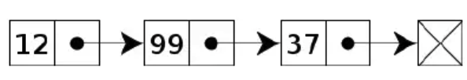
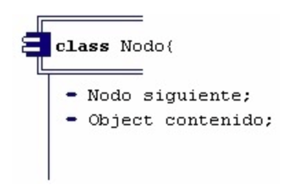
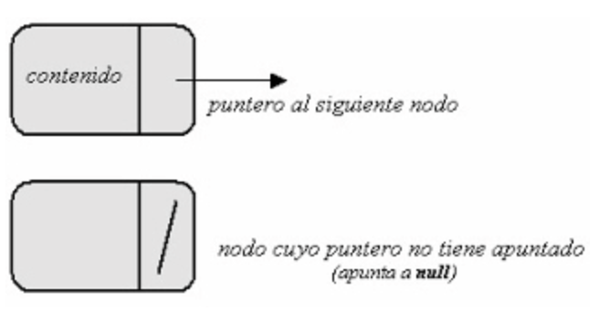
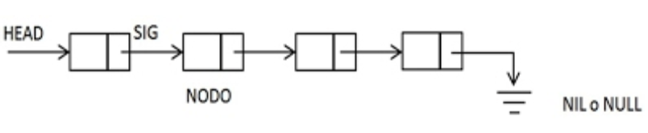

#LISTAS ENLAZADAS
Es una secuencia de nodos, en donde almacenan campos de datos arbitrarios y una o dos 
referencias al nodo anterior o posterior.

Esta conformado de dos partes:

- CABEZA: Es el primer nodo de una lista enlazada
- COLA: Ultimo nodo de la lista enlazada

###Uso de listas enlazadas
- El orden de los elementos enlazados puede ser diferente al orden de almacenamiento en memoria, permitiendo
que el orden de recorrido de la lista sea diferente al de almacenamiento.
- Permiten inserciones o eliminacion de nodos en cualquier punto de la lista en tiempo constante.
-  Un arreglo asigna memoria para todos sus elementos ordenados como un solo bloque. En cambio, la lista enlazada asigna
   espacio para cada elemento por separado, en su propio bloque de memoria llamado nodo.
- La lista conecta estos nodos usando punteros, formando una estructura parecida a una cadena.

 
 
- Un nodo es un objeto como cualquier otro y sus atrivutos seran los encargados de hacer el trabajo de almacenar y apuntar a optro nodo.
  Cada nodo tiene dos atributos: Un atributo "contenido" usada para almacenar un dato y otro atributo "siguiente", usado para hacer referencia al siguiente 
  nodo de la lista.
  
  
- Los nodos seran representados por los siguientes simbolos.

   

##LISTAS ENLAZADAS SIMPLES O LISTA SIMPLEMENTE ENLAZADA
 3. Es la parte mas fundamental de las estructuras de datos basada en punteros y de ésta derivan las otras estructuras de datos.
 1.  La lista conecta estos nodos usando punteros, formando una estructura aprecida a la de una cadena.
  
 2. Las listas enlazadas simples tienen solo un enlace por nodo. Este apunta al siguiente nodo 
en la lista, o al valor Nulo o lista Vacia si es el último nodo.